# Memory System — Architecture & Internals

The Memory System provides **persistent, intelligent document retrieval** for cyberk-flow projects. It indexes markdown documents, chunks them into semantic units, creates full-text and vector indexes, and provides hybrid search with confidence scoring, PageRank blending, and co-access tracking.

## Quick Reference

| Command | Description |
| --- | --- |
| `bun run cf index` | Index/re-index all documents |
| `bun run cf search <query>` | Search memory (hybrid mode) |
| `bun run cf search <query> --mode keyword` | Keyword-only search |
| `bun run cf search <query> --label spec` | Filter by label |
| `bun run cf search <query> --no-dedupe` | Show all chunks (no dedup) |
| `bun run cf search <query> --max-chunks-per-doc 3` | Allow N chunks per document |
| `bun run cf gc` | Run garbage collection (dedup + prune) |

---

## System Overview

The memory system is composed of 10 modules, each with a single responsibility:

| Module | File | Purpose |
| --- | --- | --- |
| **Database** | `db.ts` | SQLite schema, migrations, WAL config |
| **Chunker** | `chunker.ts` | Split markdown into heading-based chunks (≤900 chars) |
| **Embeddings** | `embeddings.ts` | Generate vector embeddings (MiniLM-L6-v2, 384 dims) |
| **Vector** | `vector.ts` | Cosine similarity, buffer ↔ Float32Array conversion |
| **Indexer** | `indexer.ts` | Discover, hash, chunk, embed, store documents |
| **Search** | `search.ts` | Hybrid search (keyword + vector + RRF), score blending |
| **Graph** | `graph.ts` | Cross-reference parsing, PageRank computation |
| **Co-Access** | `co-access.ts` | Track which documents are accessed together |
| **Consolidation** | `consolidation.ts` | Dedup near-duplicate chunks, prune stale documents |
| **Contradiction** | `contradiction.ts` | Detect conflicting requirements between specs |

---

## System Architecture

```mermaid
flowchart TB
    subgraph Indexing["📥 Indexing Pipeline"]
        direction TB
        D["Discover Files\nspecs/ · archive/ · docs/"]
        H["Hash Content\nSHA-256"]
        CK["Chunk Markdown\n≤900 chars per chunk"]
        EM["Generate Embeddings\nMiniLM-L6-v2 · 384d"]
        ST["Store in SQLite\ndocuments + chunks + FTS5 + vec"]
        PR["Compute PageRank\npower iteration · d=0.85"]
        D --> H --> CK --> EM --> ST --> PR
    end

    subgraph Search["🔍 Search Pipeline"]
        direction TB
        Q["Query Input"]
        KW["Keyword Search\nFTS5 full-text"]
        VS["Vector Search\ncosine similarity"]
        RRF["RRF Merge\nK=60"]
        BL["Score Blending\nconfidence × pagerank"]
        DD["Deduplicate\ntop N per doc"]
        TR["Track Access\nboost + co-access"]
        Q --> KW & VS
        KW & VS --> RRF --> BL --> DD --> TR
    end

    subgraph Maintenance["🧹 Maintenance"]
        direction TB
        GC["cf gc"]
        DUP["Dedup Chunks\ncosine ≥ 0.95"]
        PRN["Prune Stale Docs\nconfidence ≤ 0.15"]
        GC --> DUP & PRN
    end

    ST -.->|"stored data"| KW
    ST -.->|"stored data"| VS
    PR -.->|"pagerank scores"| BL
```



---

## Data Flow — Indexing Pipeline

When `bun run cf index` runs, the system walks through a multi-stage pipeline:

```
Discover files → Read & hash → Chunk markdown → Generate embeddings → Store in SQLite → Compute PageRank
```

### Indexed Directories

Only these directories are scanned:

| Directory | Label | Content Type |
| --- | --- | --- |
| `cyberk-flow/specs/` | `spec` | Canonical specifications |
| `cyberk-flow/changes/archive/` | varies | Archived change artifacts |
| `docs/` | `doc` or `knowledge` | Project documentation |

> **Note:** Active changes (`cyberk-flow/changes/<name>/`) are NOT indexed — only archived changes.

### Content Hashing & Incremental Updates

Each file is SHA-256 hashed. On re-index:

- **Hash unchanged** → skip (metadata-only sync for label/doc_type if needed)
- **Hash changed** → delete old chunks, re-chunk, re-embed, store
- **File deleted** → remove document and all chunks from DB

---

## Document Classification

Every document receives two classifications at index time:

### Doc Type

Determines how the document is treated in search and consolidation.

| Doc Type | When Applied | Examples |
| --- | --- | --- |
| `procedural` | `workflow.md`, `tasks.md`, archived `proposal.md` | Step-by-step workflows, task lists |
| `semantic` | Everything else (specs, docs, knowledge) | Conceptual content, specifications |

### Label

A finer-grained tag for filtering search results.

| Label | Path Pattern | Purpose |
| --- | --- | --- |
| `spec` | `cyberk-flow/specs/**` | Canonical specs |
| `delta-spec` | `archive/*/specs/**` | Archived delta specs |
| `discovery` | `archive/*/discovery.md` | Discovery documents |
| `proposal` | `archive/*/proposal.md` | Change proposals |
| `tasks` | `archive/*/tasks.md` | Task lists |
| `workflow` | `archive/*/workflow.md` | Workflow state |
| `design` | `archive/*/design.md` | Design documents |
| `archive` | `archive/*/**` (catch-all) | Other archived files |
| `knowledge` | `cyberk-flow/knowledge/**` | Extracted knowledge |
| `doc` | `docs/**` | General documentation |

---

## Chunking Strategy

Markdown files are split into chunks for granular retrieval:

1. **Split on headings** — H1, H2, H3 create new section boundaries
2. **Cap chunk size** — each chunk ≤ 900 characters
3. **Oversized sections** → split on blank lines (paragraphs), then on line boundaries
4. **Each chunk** retains its heading context for search relevance

```
┌─────────────────────────────┐
│ ## Authentication           │ ← heading: "Authentication"
│                             │
│ JWT validation requires...  │ ← chunk 0 (≤900 chars)
│ ─ ─ ─ ─ ─ ─ ─ ─ ─ ─ ─ ─   │
│ Token refresh flow uses...  │ ← chunk 1 (if section > 900)
├─────────────────────────────┤
│ ## Authorization            │ ← heading: "Authorization"
│                             │
│ Role-based access control...│ ← chunk 2
└─────────────────────────────┘
```

---

## Search Architecture

The search system supports three modes with intelligent fallback:

### Search Modes

| Mode | Strategy | Best For |
| --- | --- | --- |
| `hybrid` (default) | Keyword + Vector → RRF merge | General queries |
| `keyword` | FTS5 full-text search only | Exact term matches |
| `vector` | Embedding cosine similarity only | Semantic/conceptual queries |

### Hybrid Search Pipeline (default)


**Stage 1 — Parallel retrieval:**
- **Keyword search**: FTS5 full-text index with `unicode61` tokenizer
- **Vector search**: Query is embedded → cosine distance via `sqlite-vec` (or JS fallback)

**Stage 2 — Reciprocal Rank Fusion (RRF):**
Results from both searches are merged using RRF with `K=60`:

```
rrfScore = 1 / (K + rank + 1)
```

Chunks appearing in both lists get `matchType: "hybrid"` and summed scores.

**Stage 3 — Score blending:**
Raw scores are adjusted by document-level signals:

```mermaid
flowchart LR
    RAW["Raw RRF Score\n1/(K+rank+1)"] --> MUL["× multiply"]
    CONF["Confidence Factor\n0.7 + 0.3 × decayed"] --> MUL
    PGR["PageRank Factor\n0.8 + 0.2 × normalized"] --> MUL
    MUL --> FINAL["Final Score"]
```



Where:
- `confidenceFactor = 0.7 + 0.3 × decayedConfidence`
- `pagerankFactor = 0.8 + 0.2 × normalizedPageRank`

**Stage 4 — Deduplication:**
Results are grouped by document path. Only the top N chunks per document are kept (default: 1). The system over-fetches candidates (`limit × maxChunksPerDoc × 3`, capped at 100) to compensate.

**Stage 5 — Access tracking:**
- Confidence is boosted for accessed documents (+3%, capped at 1.0)
- Co-access pairs are recorded for the top 5 result documents

### Fallback Chain

If a search mode produces no results, it cascades:


---

## Confidence Scoring

Every document has a **confidence score** (0.0–1.0) that represents how relevant and fresh it is. This score influences search ranking through blending.

### Confidence Lifecycle

```mermaid
stateDiagram-v2
    [*] --> Fresh: Document indexed
    Fresh --> Boosted: Search hit (×1.03)
    Boosted --> Boosted: Search hit (×1.03, cap 1.0)
    Fresh --> Decaying: Time passes (×0.995^h)
    Boosted --> Decaying: Time passes (×0.995^h)
    Decaying --> Decaying: More time (floor 0.1)
    Decaying --> Boosted: Search hit (×1.03)
    Decaying --> Pruned: cf gc (≤0.15 + 0 access + >30d)
    Pruned --> [*]

    state Fresh {
        [*]: confidence = 0.8
    }
```



### Decay Formula

Confidence decays exponentially based on time since last access (or last update if never accessed):

```
decayedConfidence = max(0.1, confidence × 0.995^hours)
```

Where `hours` = time elapsed since `last_accessed_at` (or `updated_at`).

| Time Since Access | Decay Multiplier | Confidence (from 0.8) |
| --- | --- | --- |
| 1 hour | 0.995 | 0.796 |
| 24 hours | 0.887 | 0.710 |
| 7 days (168h) | 0.430 | 0.344 |
| 30 days (720h) | 0.027 | 0.100 (floor) |

### Access Boost

When a document appears in search results:

```
newConfidence = min(confidence × 1.03, 1.0)
access_count += 1
last_accessed_at = now
```

This creates a **positive feedback loop**: frequently accessed documents rise in ranking, while unused documents naturally decay.

---

## Knowledge Graph & PageRank

The system builds a **knowledge graph** from cross-references between documents, then computes PageRank scores to identify authoritative documents.

### Reference Parsing

Three patterns are detected:

| Pattern | Example | Extracted Target |
| --- | --- | --- |
| Markdown links | `[auth](cyberk-flow/specs/auth/spec.md)` | `cyberk-flow/specs/auth/spec.md` |
| Bare spec mentions | `specs/auth` in text | `cyberk-flow/specs/auth/spec.md` |
| Ref lines | `Refs: auth, users` | `cyberk-flow/specs/auth/spec.md`, etc. |

External URLs (`http://`, `https://`, `#`) and self-references are excluded.

### Example Knowledge Graph


In this example, `specs/users` receives the highest PageRank because it is referenced by 3 other documents.

### PageRank Algorithm

- **Damping factor**: 0.85
- **Convergence**: L1 norm < 1e-6
- **Max iterations**: 50
- **Dangling nodes**: distribute rank evenly across all nodes

Documents referenced by many others get higher PageRank → they rank higher in search results via the blending factor `0.8 + 0.2 × normalizedPageRank`.

---

## Co-Access Tracking

When a search returns multiple documents, the system records which documents are accessed together. This powers the "related documents" feature.

### How It Works

1. After search, the top 5 result documents are selected
2. All unique pairs are recorded in the `co_access` table
3. Repeated co-access increments the `co_count`

### Querying Related Documents

```ts
const related = store.getRelated("docs/auth.md", 5);
// Returns: [{ path: "docs/users.md", coAccessCount: 12, lastCoAccess: "..." }]
```

---

## Consolidation (Garbage Collection)

`bun run cf gc` runs two cleanup processes:

### 1. Chunk Deduplication

Finds near-duplicate chunks (cosine similarity ≥ 0.95) and keeps the one from the newer document. Requires vector embeddings to be present.

### 2. Document Pruning

Removes documents that meet ALL of these conditions:

| Condition | Threshold |
| --- | --- |
| Decayed confidence | ≤ 0.15 |
| Access count | = 0 (never accessed via search) |
| Age | > 30 days since last update |

---

## Contradiction Detection

When validating changes (`bun run cf validate`), the system checks for contradictions between delta specs and existing canonical specs.

### Energy Scoring

Each delta requirement is compared against all requirements in the corresponding canonical spec:

```mermaid
flowchart LR
    D["Delta Spec\nADDED/MODIFIED reqs"] --> CMP["Compare each pair"]
    M["Main Spec\nexisting reqs"] --> CMP
    CMP --> ANT["Antonym Score\n7 word pairs × 0.6"]
    CMP --> JAC["Jaccard Overlap\ntoken similarity × 0.4"]
    ANT --> E["Energy = ant×0.6 + jac×0.4"]
    JAC --> E
    E -->|"≥ 0.7"| REJ["❌ REJECT"]
    E -->|"≥ 0.3"| WARN["⚠️ WARN"]
    E -->|"< 0.3"| OK["✅ ALLOW"]
```



| Energy | Level | Action |
| --- | --- | --- |
| ≥ 0.7 | `reject` | Validation error — must resolve |
| ≥ 0.3 | `warn` | Warning — review recommended |
| < 0.3 | `allow` | No conflict detected |

### Antonym Detection

Uses word-boundary matching for 7 antonym pairs:

`must/never`, `always/don't`, `enable/disable`, `allow/deny`, `require/forbid`, `include/exclude`, `add/remove`

---

## Database Schema (v3)


---

## Embedding Model

| Property | Value |
| --- | --- |
| Model | `Xenova/all-MiniLM-L6-v2` |
| Dimensions | 384 |
| Runtime | `@huggingface/transformers` |
| Fallback | `NoopEmbeddingProvider` (dimensions=0, keyword-only) |

When embeddings are unavailable (e.g., model fails to load), the system gracefully degrades to keyword-only search.

When embedding dimensions change (e.g., switching models), all stored embeddings are cleared and re-generated on next index.

---

## MemoryStore API

The public API surface for programmatic access:

```ts
import { createMemoryStore } from "./lib/memory/index";

const store = createMemoryStore(projectRoot);

// Index documents
const summary = await store.index();
// → { added: 5, updated: 1, removed: 0, unchanged: 10 }

// Search
const results = await store.search("authentication", {
  mode: "hybrid",    // "keyword" | "vector" | "hybrid"
  limit: 10,
  label: "spec",     // filter by label
  docType: "semantic", // filter by doc type
  dedupe: true,      // group by document path
  maxChunksPerDoc: 1,
});

// Garbage collection
const gc = await store.gc();
// → { deduplicatedChunks: 3, prunedDocuments: 1 }

// Related documents
const related = store.getRelated("docs/auth.md", 5);

// Contradiction detection
const issues = await store.checkContradictions("cyberk-flow/changes/my-change");

store.close();
```
