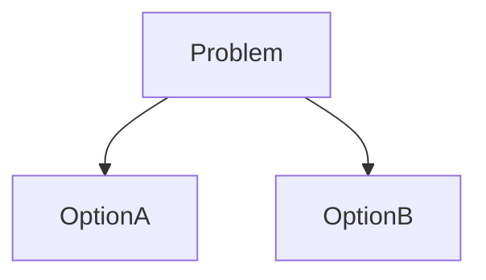

# Discovery: <Feature Name>

## 1. Feature Summary
<1-2 sentence description>

## 2. Workstreams Used / Skipped

| Workstream           | Used? | Justification |
| -------------------- | ----- | ------------- |
| Memory Recall        | ✅/⏭️  | ...           |
| Architecture Snapshot | ✅/⏭️  | ...           |
| Internal Patterns    | ✅/⏭️  | ...           |
| External Patterns    | ✅/⏭️  | ...           |
| Constraint Check     | ✅/⏭️  | ...           |
| Documentation        | ✅/⏭️  | ...           |

## 3. Memory Recall

### Related Results

| Source | Path | Heading | Relevance Score |
| ------ | ---- | ------- | --------------- |
| ...    | ...  | ...     | ...             |

### Key Findings
- ...

## 4. Architecture Snapshot

### Relevant Packages
| Package        | Purpose | Key Files |
| -------------- | ------- | --------- |
| `packages/...` | ...     | ...       |

### Entry Points
- API: ...
- UI: ...

## 5. Internal Patterns

### Similar Implementations
| Feature | Location | Pattern Used |
| ------- | -------- | ------------ |
| ...     | ...      | ...          |

### Reusable Utilities
- Validation: ...
- Error handling: ...

## 6. Constraint Check
- Dependencies: ...
- Build Requirements: ...
- Database: ...

## 7. External Patterns & Documentation
- Library Docs: ...
- Similar Projects: ...
- API Docs: ...

## 8. Gap Analysis (Synthesized)
| Component | Have        | Need          | Gap Size |
| --------- | ----------- | ------------- | -------- |
| API       | None        | POST /v1/auth | New      |
| DB        | User Schema | 2FA Columns   | Small    |

## 9. Key Decisions

| Decision | Options Considered | Chosen | Rationale |
| -------- | ------------------ | ------ | --------- |
| ...      | ...                | ...    | ...       |

<!-- If multiple viable solutions, add decision diagram + pros/cons for approval gate -->

## 10. Options Comparison _(only if multiple viable solutions)_

| Option   | Pros | Cons | Recommendation |
| -------- | ---- | ---- | -------------- |
| Option A | ...  | ...  | ...            |
| Option B | ...  | ...  | ...            |

## 11. Risks & Constraints
- **Must**: [hard constraints — security, compat, perf]
- **Should**: [soft constraints — conventions, preferences]

## 12. Open Questions
- [ ] ...
