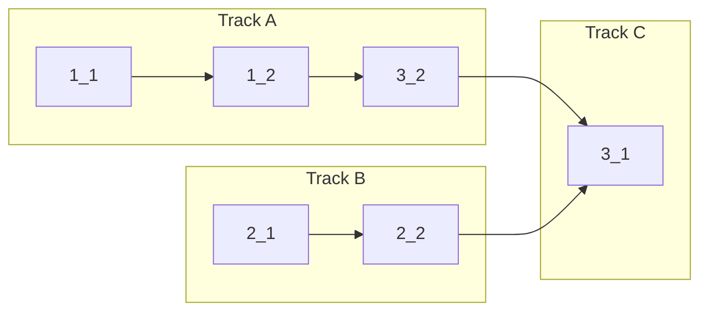

<!-- Dependency graph: a track is a sequential chain of tasks executed by one sub-agent. -->
<!-- Different tracks run as concurrent sub-agents. -->
<!-- A track may contain tasks from different sections. -->
<!-- Spikes (0_x) run before the graph and are NOT included in it. -->
<!-- If any 0_x spikes exist, complete ALL spikes before starting any track. -->
<!-- Every Deps entry MUST have a matching arrow in the graph, and vice versa. -->
<!-- Mermaid node IDs use `t` prefix (t1_1); labels show the task ID ("1_1"). -->

## 0. Spikes _(only if design.md Risk Map has HIGH items)_

<!-- Remove this section if no HIGH risk items -->

- [ ] 0_1 **[SPIKE]** <!-- Validate <assumption> --> — timebox: <!-- 30min/2h -->
  - **Refs**: <!-- design.md#Risk-Map -->
  - **Done**: <!-- Decision documented; spike code discarded or promoted -->

## 1. <!-- Section name (group by concern) -->

- [ ] 1_1 <!-- Verb-led task description -->
  - **Track**: A
  - **Refs**: <!-- specs/<cap>/spec.md#RN; design.md#Section -->
  - **Done**: <!-- "Scenario X passes" or measurable criteria -->
  - **Files** _(required for parallel tracks; optional for single-track)_: <!-- list all files this task will modify -->

- [ ] 1_2 <!-- Verb-led task description -->
  - **Track**: A
  - **Deps**: 1_1
  - **Refs**: <!-- spec/design anchors -->
  - **Done**: <!-- measurable criteria -->

## 2. <!-- Section name -->

- [ ] 2_1 <!-- Verb-led task description -->
  - **Track**: B
  - **Refs**: <!-- spec/design anchors -->
  - **Done**: <!-- measurable criteria -->

- [ ] 2_2 <!-- Verb-led task description -->
  - **Track**: B
  - **Deps**: 2_1
  - **Refs**: <!-- spec/design anchors -->
  - **Done**: <!-- measurable criteria -->

## 3. <!-- Section name -->

- [ ] 3_1 <!-- Verb-led task description (waits for all tracks) -->
  - **Track**: C
  - **Deps**: 3_2, 2_2
  - **Refs**: <!-- spec/design anchors -->
  - **Done**: <!-- measurable criteria -->

- [ ] 3_2 <!-- Verb-led task description -->
  - **Track**: A
  - **Deps**: 1_2
  - **Refs**: <!-- spec/design anchors -->
  - **Done**: <!-- measurable criteria -->
