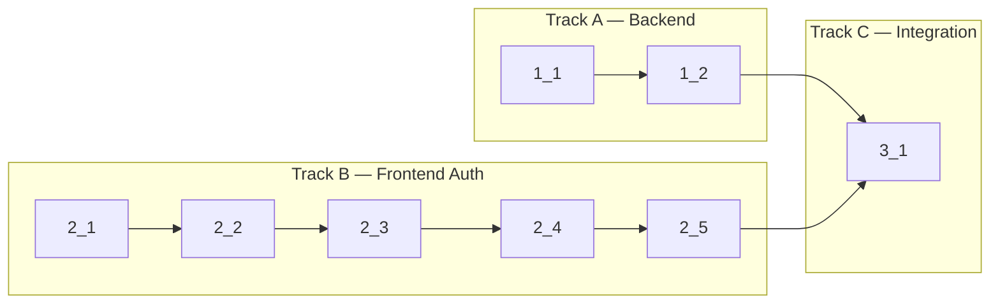

**Verify**: `bun run check-types` · `bun run check`

## 1. Backend — SIWE Plugin Setup

- [x] 1_1 Add `viem` dependency to `packages/auth` and configure SIWE plugin in `packages/auth/src/index.ts` with `anonymous: true`, `viem.verifyMessage`, `generateRandomString` nonce, domain derived from env
  - **Track**: A
  - **Refs**: specs/auth/spec.md#SIWE-Server-Plugin
  - **Done**: `siwe()` plugin present in better-auth config with viem verification; `bun run check-types` passes for `packages/auth`
  - **Files**: `packages/auth/package.json`, `packages/auth/src/index.ts`

- [x] 1_2 Generate Drizzle schema for `walletAddress` table and push to DB
  - **Track**: A
  - **Deps**: 1_1
  - **Refs**: specs/auth/spec.md#Database-Migration
  - **Done**: `walletAddress` table schema exists in `packages/db/src/schema/auth.ts`; `bun run db:push` succeeds
  - **Files**: `packages/db/src/schema/auth.ts`

## 2. Frontend — SIWE Auth UI

- [x] 2_1 Add `siweClient()` plugin to `apps/web/src/shared/api/auth-client.ts`
  - **Track**: B
  - **Refs**: specs/auth/spec.md#SIWE-Client-Plugin
  - **Done**: `authClient.siwe` is typed and accessible; `bun run check-types` passes
  - **Files**: `apps/web/src/shared/api/auth-client.ts`

- [x] 2_2 Create `WalletSignInButton` component at `apps/web/src/features/auth/sign-in/ui/wallet-sign-in-button.tsx` — connect wallet via wagmi, get nonce, construct SIWE message, sign, verify. Follow `GoogleSignInButton` pattern.
  - **Track**: B
  - **Deps**: 2_1
  - **Refs**: specs/auth/spec.md#Wallet-Sign-In
  - **Done**: Component renders; handles connect → nonce → sign → verify flow; shows error on rejection
  - **Files**: `apps/web/src/features/auth/sign-in/ui/wallet-sign-in-button.tsx`, `apps/web/src/features/auth/sign-in/index.ts`

- [x] 2_3 Add `WalletSignInButton` to sign-in and sign-up pages
  - **Track**: B
  - **Deps**: 2_2
  - **Refs**: specs/auth/spec.md#Wallet-Sign-In, specs/auth/spec.md#Wallet-Sign-Up
  - **Done**: Wallet button visible on both `/sign-in` and `/sign-up` pages
  - **Files**: sign-in page layout, sign-up page layout

- [x] 2_4 Create `LinkWalletButton` component at `apps/web/src/features/auth/link-provider/ui/link-wallet-button.tsx` following `LinkGoogleButton` pattern; add to profile screen with wallet display section showing linked wallets from `walletAddress` table
  - **Track**: B
  - **Deps**: 2_3
  - **Refs**: specs/auth/spec.md#Wallet-Linking-on-Profile, specs/auth/spec.md#Linked-Wallets-Display-on-Profile
  - **Done**: Profile page shows linked wallets; "Link Wallet" button works; error shown if wallet already linked to another user
  - **Files**: `apps/web/src/features/auth/link-provider/ui/link-wallet-button.tsx`, `apps/web/src/features/auth/link-provider/index.ts`, `apps/web/src/screens/profile/ui/profile-screen.tsx`

- [x] 2_5 Handle anonymous wallet-user profile: show wallet address as identifier when email is null; show "No email linked" placeholder
  - **Track**: B
  - **Deps**: 2_4
  - **Refs**: specs/auth/spec.md#Anonymous-Wallet-User-Profile
  - **Done**: Wallet-only user profile renders without errors; wallet address shown as primary identifier
  - **Files**: `apps/web/src/screens/profile/ui/profile-screen.tsx`

## 4. Account Linking & Error Handling

- [x] 4_1 Configure account linking in `packages/auth/src/index.ts` with `enabled: true`, `allowDifferentEmails: true`, `trustedProviders: ["google"]`
  - **Refs**: specs/auth/spec.md#Account-Linking-Configuration
  - **Done**: `account.accountLinking` config present in better-auth config; wallet users can link Google accounts with different emails
  - **Files**: `packages/auth/src/index.ts`

- [x] 4_2 Add `errorCallbackURL` to `linkSocial` call in `apps/web/src/features/auth/link-provider/ui/link-google-button.tsx`
  - **Refs**: specs/auth/spec.md#OAuth-Link-Error-Redirect
  - **Done**: OAuth errors redirect to profile page with `?error=...` query param instead of backend error page
  - **Files**: `apps/web/src/features/auth/link-provider/ui/link-google-button.tsx`

- [x] 4_3 Add OAuth error toast to profile screen — read `?error=` query param on mount and display user-friendly toast notification
  - **Refs**: specs/auth/spec.md#OAuth-Link-Error-Display
  - **Done**: Profile page shows toast for `account_already_linked_to_different_user` and other OAuth errors
  - **Files**: `apps/web/src/screens/profile/ui/profile-screen.tsx`

## 3. Integration & Verification

- [x] 3_1 Run full verify commands, fix any type errors or lint issues across all modified packages
  - **Track**: C
  - **Deps**: 1_2, 2_5
  - **Refs**: All specs
  - **Done**: `bun run check-types` and `bun run check` pass with zero errors
