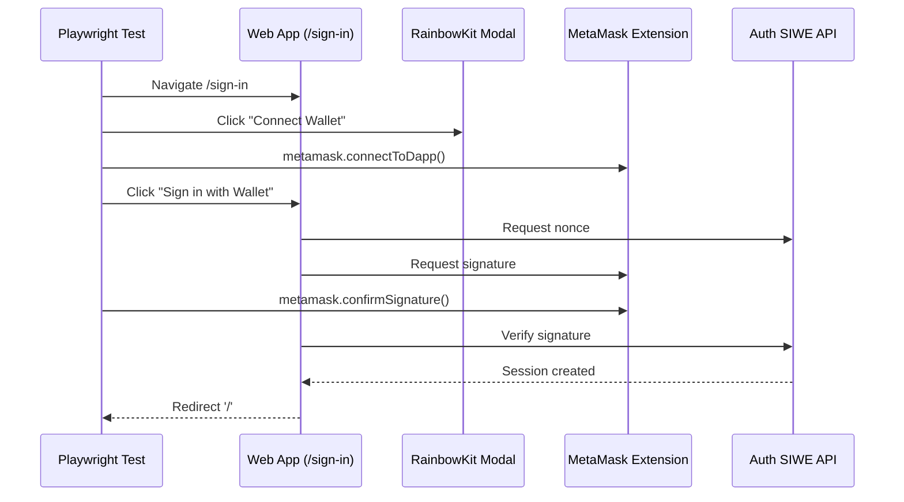

# Design: Playwright + Synpress MetaMask SIWE E2E

## Goals / Non-Goals

- **Goals**:
  - Add a local-first E2E harness for MetaMask wallet flows using Playwright + Synpress.
  - Keep first scenario minimal and deterministic: SIWE happy path on `/sign-in`.
  - Provide resilient local setup and troubleshooting guidance for known Synpress friction points.
- **Non-Goals**:
  - CI orchestration and distributed E2E execution.
  - Expanded wallet/auth matrices (rejection cases, linking, profile state).
  - Support for non-MetaMask wallets.

## Architecture

```mermaid
flowchart LR
    A[Developer runs wallet setup] --> B[Synpress builds wallet cache]
    B --> C[Playwright test with Synpress fixtures]
    C --> D[Open /sign-in]
    D --> E[RainbowKit connect modal]
    E --> F[MetaMask connectToDapp]
    F --> G[Click Sign in with Wallet]
    G --> H[MetaMask confirmSignature]
    H --> I[SIWE verify success]
    I --> J[Redirect to /]
```

## Gap Analysis

| Component | Have | Need | Gap |
| --- | --- | --- | --- |
| Test runner | No Playwright config in repo | Playwright + Synpress local config and scripts | New |
| Wallet fixture | Empty `e2e/wallet-setup/` | Deterministic MetaMask setup file and setup command | New |
| E2E spec | No web3 browser tests | SIWE happy-path spec in `e2e/specs/` | New |
| Dev runbook | No E2E docs for wallet tests | Local troubleshooting guide for common failures | Medium |

## Decisions

### Use Synpress fixture-based MetaMask control

Use `testWithSynpress(metaMaskFixtures(...))` and instantiate `MetaMask` in tests rather than handcrafting extension automation. This keeps implementation aligned with official Synpress Playwright patterns and reduces direct selector coupling with MetaMask internals.

### Keep phase-1 execution local-only

Do not optimize for CI yet. Local-only execution allows faster stabilization against extension/version churn, especially while establishing the first reliable SIWE case.

### Start with a single golden path

The first test asserts only successful SIWE sign-in redirect to `/`. This provides a stable baseline before adding heavier assertions or negative paths.

### Interface Sketch (MEDIUM Risk Item)

## Risk Map

| Component | Risk Level | Reason | Verification |
| --- | --- | --- | --- |
| Playwright + Synpress dependency alignment | MEDIUM | Version drift can break extension launch/chromium compatibility | Lock versions; verify with first local run |
| Wallet cache lifecycle | MEDIUM | Stale/invalid cache causes nondeterministic startup failures | Add explicit cache rebuild workflow in runbook |
| RainbowKit modal orchestration | MEDIUM | Connect modal can be timing-sensitive under automation | Use semantic selectors + explicit waits in spec |
| SIWE happy-path assertion | LOW | Existing app flow already implemented and manually testable | Redirect assertion to `/` |

## Migration Plan

1. Add Playwright/Synpress dependencies and local scripts.
2. Add wallet setup fixture and cache generation command.
3. Add SIWE happy-path spec and stabilize selectors/waits.
4. Document local environment setup and issue-recovery playbook.

Rollback: remove added dependencies/scripts and `e2e` assets if stack proves unstable.

## Open Questions

- [x] Local-only vs CI in phase 1 -> Local-only.
- [x] Scope of first assertion -> Redirect success only.
