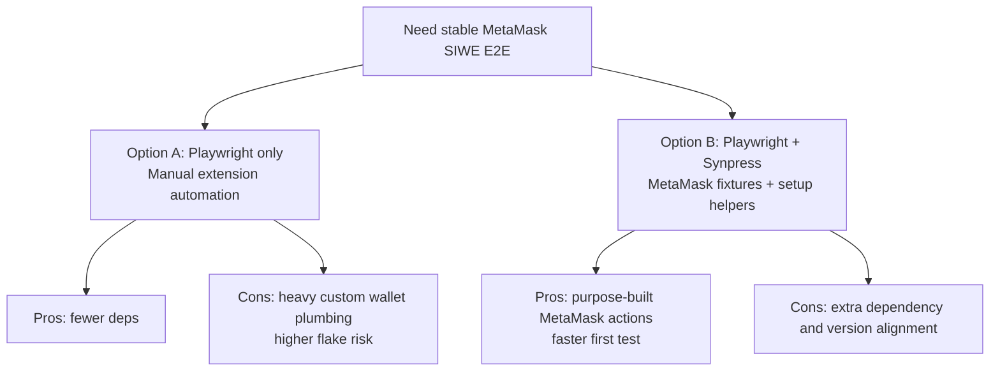

# Discovery: Integrate Playwright for MetaMask SIWE E2E

## 1. Feature Summary

Add an E2E testing stack for wallet authentication that can automate MetaMask + RainbowKit interactions and verify the first end-to-end SIWE sign-in scenario.

## 2. Workstreams Used / Skipped

| Workstream | Used? | Justification |
| --- | --- | --- |
| Architecture Snapshot | ✅ | Needed to map existing auth, wallet provider, and e2e layout. |
| Internal Patterns | ✅ | Existing SIWE UI and auth backend patterns can be reused for assertions and setup. |
| External Patterns | ✅ | Synpress support quality and Playwright integration had to be validated before choosing stack. |
| Constraint Check | ✅ | Required for new dev dependencies, scripts, and CI/runtime constraints. |
| Documentation | ✅ | Synpress Playwright fixtures/APIs were reviewed for MetaMask automation fit. |

## 3. Architecture Snapshot

### Relevant Packages
| Package | Purpose | Key Files |
| --- | --- | --- |
| `apps/web` | RainbowKit + Wagmi client app and SIWE sign-in UI | `src/shared/lib/wallet/evm-config.ts`, `src/shared/providers/evm-provider.tsx`, `src/features/auth/sign-in/ui/wallet-sign-in-button.tsx`, `src/screens/sign-in/ui/sign-in-screen.tsx` |
| `packages/auth` | better-auth server with SIWE plugin | `src/index.ts`, `src/__tests__/siwe-auth.test.ts` |
| `packages/api` | Wallet/provider data surface for profile/auth ecosystem | `src/routers/wallet.ts` |
| `e2e` | Reserved location for end-to-end assets | `e2e/specs/`, `e2e/fixtures/`, `e2e/wallet-setup/` |

### Entry Points
- Web sign-in route: `apps/web/src/app/sign-in/page.tsx`
- Wallet SIWE button flow: `apps/web/src/features/auth/sign-in/ui/wallet-sign-in-button.tsx`
- EVM chain config (Sepolia): `apps/web/src/shared/lib/wallet/evm-config.ts`
- Auth SIWE plugin boundary: `packages/auth/src/index.ts`

## 4. Internal Patterns

### Similar Implementations
| Feature | Location | Pattern Used |
| --- | --- | --- |
| SIWE auth behavior verification | `packages/auth/src/__tests__/siwe-auth.test.ts` | Nonce -> signed SIWE message -> verify contract assertions |
| Wallet sign-in UI flow | `apps/web/src/features/auth/sign-in/ui/wallet-sign-in-button.tsx` | RainbowKit connect modal + wagmi sign message + better-auth verify |
| Redirect after auth | `apps/web/src/screens/sign-in/ui/sign-in-screen.tsx` | Redirect to `/` after authenticated session |

### Reusable Utilities
- Existing `wallet-sign-in-button` text states (`Connect Wallet`, `Sign in with Wallet`, `Signing in...`) are stable assertions for first E2E case.
- Existing `e2e/` root can host Playwright/Synpress fixtures without restructuring app packages.

## 5. Constraint Check

- New dependencies are required (Playwright + Synpress package set).
- Browser extension automation requires Chromium-based execution (not WebKit/Firefox).
- CI must support persistent extension profile and deterministic wallet seed import.
- Current repo has no Playwright config; test entrypoint, scripts, and test env setup are all new.

## 6. External Patterns & Documentation

- Synpress documentation confirms Playwright fixtures for MetaMask (`metaMaskFixtures`, wallet setup APIs such as `importWallet`, `connectToDapp`, `confirmSignature`).
- Known community signal: RainbowKit modal interactions can be timing-sensitive; tests should stabilize with explicit waits and deterministic wallet setup.
- Successful reference projects and sources reviewed:
  - `DavitMkhitaryan/dapp-test-automation-playwright-synpress` (clear folder structure, practical env contract, and local run workflow)
  - `synpress-io/synpress-examples-v3` (isolated-state vs shared-state patterns for Playwright plugin usage)
  - Synpress Playwright guide (`docs.synpress.io/docs/guides/playwright`) for canonical fixture setup

### Common Failure Modes and Mitigations

| Failure Mode | Practical Mitigation |
| --- | --- |
| Playwright/Synpress Chromium mismatch | Pin compatible versions and keep lockfile stable; avoid floating major/minor updates during initial rollout. |
| Wallet setup cache not found or stale | Keep wallet setup file path/name deterministic (`e2e/wallet-setup/metamask.setup.ts`) and clear/rebuild `.cache-synpress` when setup changes. |
| RainbowKit modal timing flake | Use role-based selectors + explicit waits for modal visibility before calling `metamask.connectToDapp()`. |
| Playwright UI mode inconsistency with extension tests | Standardize on CLI execution for reliability in first phase; treat UI mode as debugging-only. |
| State leakage across tests | Run first phase with a single isolated spec and deterministic wallet account; avoid parallelism until baseline is stable. |

## 7. Gap Analysis (Synthesized)

| Component | Have | Need | Gap Size |
| --- | --- | --- | --- |
| E2E runner | Empty `e2e/` folders only | Playwright project config, scripts, and reporter output setup | New |
| Wallet automation | No browser-extension test harness | Synpress wallet setup + MetaMask fixture integration | New |
| SIWE happy-path spec | SIWE unit/integration tests in backend only | Browser-level SIWE sign-in case with MetaMask and RainbowKit UI | New |
| Test data handling | No dedicated wallet fixture input in e2e | Seed/private-key fixture strategy and local-only secrets guidance | Medium |

## 8. Key Decisions

| Decision | Options Considered | Chosen | Rationale |
| --- | --- | --- | --- |
| Web3 E2E harness | Playwright only vs Playwright + Synpress | Playwright + Synpress | Synpress removes most MetaMask extension plumbing and provides purpose-built wallet actions. |
| First test scope | Full auth matrix vs one golden path | One SIWE happy path | Fastest path to prove stack viability and de-risk flaky wallet automation early. |
| Network under test | Mainnet vs Sepolia | Sepolia | Already configured in app and safe/non-production for deterministic wallet testing. |

## 9. Options Comparison

| Option | Pros | Cons | Recommendation |
| --- | --- | --- | --- |
| Option A: Playwright only | No Synpress lock-in | High implementation effort for extension setup; more brittle selectors in MetaMask internals | Not recommended for this phase |
| Option B: Playwright + Synpress | Fast bootstrap for MetaMask flows; tested APIs for connect/signature flows | Need dependency/version compatibility checks | Recommended |

## 10. Risks & Constraints

- **Must**: Keep seed phrase/private key out of committed files and avoid `.env` reads in agent workflows.
- **Must**: Pin compatible Synpress + Playwright versions to reduce extension automation drift.
- **Should**: Keep first case small (single happy path) to establish a stable baseline before adding negative/edge cases.
- **Should**: Prefer semantic selectors in app UI and minimal direct MetaMask internal selector dependence.

## 11. Open Questions

- [x] Which execution target is priority first: local developer machine only, or local + CI runner? → Local only (phase 1)
- [x] Should first SIWE case assert only successful sign-in redirect, or also assert linked provider/account state in profile? → Simple SIWE happy path first (connect + sign + redirect)
