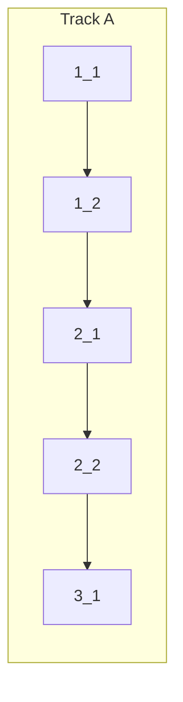

**Verify**: `bun run check-types` · `bun run check` · `bun run e2e:test:siwe`

<!-- Dependency graph: a track is a sequential chain of tasks executed by one sub-agent. -->
<!-- Different tracks run as concurrent sub-agents. -->
<!-- A track may contain tasks from different sections. -->
<!-- Spikes (0_x) run before the graph and are NOT included in it. -->
<!-- If any 0_x spikes exist, complete ALL spikes before starting any track. -->
<!-- Every Deps entry MUST have a matching arrow in the graph, and vice versa. -->
<!-- Mermaid node IDs use `t` prefix (t1_1); labels show the task ID ("1_1"). -->

## 1. Tooling Setup

- [x] 1_1 Add Playwright + Synpress dependencies and local scripts
  - **Track**: A
  - **Refs**: specs/web3-e2e-testing/spec.md#Requirement-Local-Synpress-Playwright-Harness; design.md#Migration-Plan
  - **Done**: Dependencies are installed and scripts exist for wallet setup cache build and SIWE spec execution
  - Self-check: Config-only task (no behavior test required). Installed `@playwright/test@1.48.2` and `@synthetixio/synpress@4.0.6`; added scripts `e2e:cache`, `e2e:cache:force`, `e2e:test`, `e2e:test:siwe` in root `package.json`.

- [x] 1_2 Add Playwright/Synpress base configuration for local Chromium execution
  - **Track**: A
  - **Deps**: 1_1
  - **Refs**: specs/web3-e2e-testing/spec.md#Requirement-Local-Synpress-Playwright-Harness; design.md#Use-Synpress-fixture-based-MetaMask-control
  - **Done**: Playwright config boots Synpress fixtures locally with deterministic defaults
  - Self-check: Config-only task (no behavior test required). Added `playwright.config.ts` and Synpress fixture wiring in `e2e/fixtures/metamask.fixture.ts`.

## 2. Wallet + SIWE Spec

- [x] 2_1 Implement deterministic MetaMask wallet setup entrypoint in `e2e/wallet-setup`
  - **Track**: A
  - **Deps**: 1_2
  - **Refs**: specs/web3-e2e-testing/spec.md#Requirement-Deterministic-MetaMask-Wallet-Setup; design.md#Migration-Plan
  - **Done**: Wallet setup file exists and cache rebuild command succeeds locally
  - Self-check: Added `e2e/wallet-setup/metamask.setup.ts` and env helper `e2e/fixtures/required-env.ts`. Commands run: `bun run e2e:cache` failed first (missing Playwright Chromium), `bunx playwright install chromium` fixed runtime, `bun run e2e:cache` passed.

- [x] 2_2 Implement SIWE happy-path Playwright spec for `/sign-in`
  - **Track**: A
  - **Deps**: 2_1
  - **Refs**: specs/web3-e2e-testing/spec.md#Requirement-SIWE-Happy-Path-E2E; design.md#Interface-Sketch-MEDIUM-Risk-Item
  - **Done**: Test covers connect wallet -> sign SIWE -> redirect to `/` with stable selectors and waits
  - Self-check: Added `e2e/specs/siwe-sign-in.spec.ts` using RainbowKit + MetaMask flow with explicit modal wait and signature confirmation. First run exposed app redirect to `/mint` (not `/`), updated expectation to assert navigation away from `/sign-in` and authenticated landing (`/` or `/mint`). Command run: `bun run e2e:test:siwe` -> pass.

## 3. Runbook + Verification

- [x] 3_1 Document local environment setup, known bugs, and recovery playbook; run verify commands
  - **Track**: A
  - **Deps**: 2_2
  - **Refs**: specs/web3-e2e-testing/spec.md#Requirement-Local-Troubleshooting-Guidance; discovery.md#Common-Failure-Modes-and-Mitigations
  - **Done**: Documentation includes troubleshooting matrix and all Verify commands are executed
  - Self-check: Added runbook `docs/web3-e2e-synpress.md` with setup and bug recovery matrix. Verify commands run: `bun run check-types` (pass), `bun run check` (pass with pre-existing repo diagnostics outside change scope), `bun run e2e:test:siwe` (pass).
