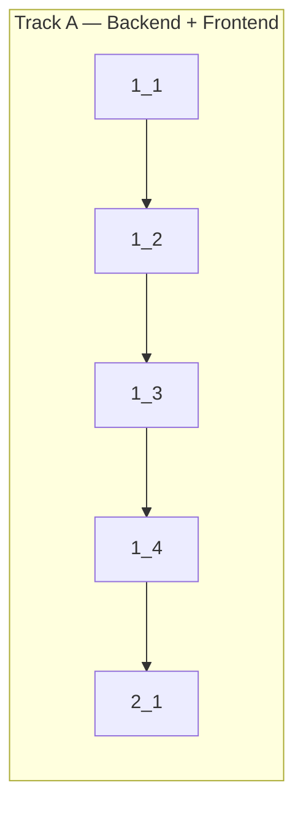

**Verify**: `bun run cf verify --e2e`

## 1. Edit Todo Feature

- [x] 1_1 Add `update` procedure to todo API router
  - **Track**: A
  - **Refs**: specs/todo-frontend/spec.md#Edit-Todo-API
  - **Done**: `update` procedure accepts `{ id: number, text: string }`, updates DB, invalidates cache
  - **Files**: `packages/api/src/routers/todo.ts`

- [x] 1_2 Create `edit-todo` feature folder with `useEditTodo` mutation hook
  - **Track**: A
  - **Deps**: 1_1
  - **Refs**: specs/todo-frontend/spec.md#Edit-Todo-Mutation-Hook
  - **Done**: `useEditTodo` hook calls `orpc.todo.update`, invalidates queries, shows toast
  - **Files**: `apps/web/src/features/todo/edit-todo/api/use-edit-todo.ts`, `apps/web/src/features/todo/edit-todo/index.ts`, `apps/web/src/features/todo/index.ts`

- [x] 1_3 Add inline edit mode to TodoItem component
  - **Track**: A
  - **Deps**: 1_2
  - **Refs**: specs/todo-frontend/spec.md#Inline-Edit-UI
  - **Done**: TodoItem supports edit mode via double-click/edit icon, Enter saves, Escape cancels, blur cancels
  - **Files**: `apps/web/src/entities/todo/ui/todo-item.tsx`

- [x] 1_4 Wire edit handler in TodosScreen and TodoList
  - **Track**: A
  - **Deps**: 1_3
  - **Refs**: specs/todo-frontend/spec.md#Edit-Todo-Screen-Wiring
  - **Done**: `onEdit` prop flows from TodosScreen → TodoList → TodoItem; edit mutation fires on save
  - **Files**: `apps/web/src/screens/todos/ui/todos-screen.tsx`, `apps/web/src/entities/todo/ui/todo-list.tsx`

## 2. E2E Testing

- [x] 2_1 Add E2E test for inline edit todo flow
  - **Track**: A
  - **Deps**: 1_4
  - **Refs**: specs/todo-frontend/spec.md#Inline-Edit-UI
  - **Done**: Playwright spec covers: enter edit mode, save with Enter, cancel with Escape, verify updated text persists
  - **Files**: `e2e/tests/todo-edit.spec.ts`
